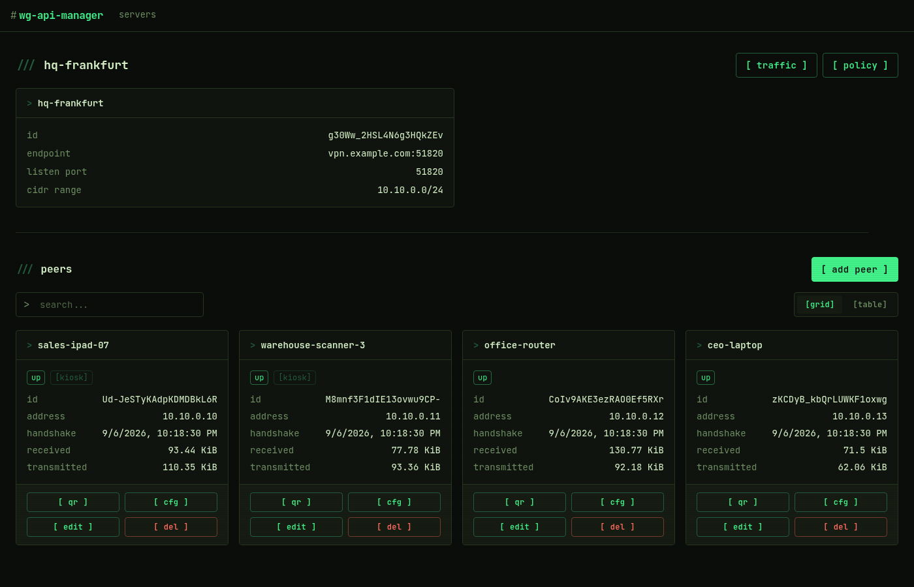

# wg-api-manager

wg-api-manager manages WireGuard VPN deployments across multiple servers from a single API, built to
automate a large-scale VPN for thin clients across multiple locations. Multi-server support is the point:
as far as I know no other project handles more than one WireGuard server per install. It's api-first,
with a web ui on top for managing configurations manually. I run it in production. It's opinionated and
documentation is thin in places - feedback and pull requests welcome.



## Features

- Multiple WireGuard servers and endpoints in one install, each with its own subnet
- No config files - everything is managed through the api or the ui
- Automatic IP allocation from each server's CIDR range
- Api-first, with a web ui on top for day-to-day management
- Client config generation, including QR codes for mobile clients
- Restricted clients: tag peers and write an ordered allow/deny policy (grants) controlling what each tag - or an
  individual peer - can reach, enforced server-side with nftables (see [Restricted Clients](#restricted-clients) below)
- Per-tag internet egress (NAT) through the VPN
- Bandwidth graphs and lifetime traffic totals, per server and per peer
- Separate administration, server and peer tokens

## Planned Features

- Desktop client
- Possibly SSO (OpenID Connect)

## Installation

### 1. Generate Administration Token

Generate a unique and cryptographically secure administration token.

```bash
openssl rand -base64 32
```

> ℹ️ if no token is provided (or is too short), a random token will be generated on startup and printed to the console.

### 2. Run wg-api-manager

wg-api-manager stores a sqlite database in the `/app/data` directory. Make sure to mount a volume to persist the database.

For the WireGuard VPN to work, the container needs the `NET_ADMIN` and `SYS_MODULE` capabilities. Additionally, the following sysctl settings are required:

```bash
sysctl 'net.ipv4.conf.all.src_valid_mark=1'
sysctl 'net.ipv4.ip_forward=1'
```

For production use, it is recommended to use a reverse proxy like Traefik to handle SSL termination.

#### Via docker run

```bash
docker run -d \
  --name wg-api-manager \
  --env ADMIN_TOKEN=(openssl rand -base64 32) \
  --volume ./wg-data:/app/data \
  --publish 51820:51820/udp \
  --publish 3000:3000/tcp \
  --cap-add NET_ADMIN \
  --cap-add SYS_MODULE \
  --sysctl 'net.ipv4.conf.all.src_valid_mark=1' \
  --sysctl 'net.ipv4.ip_forward=1' \
  --restart unless-stopped \
  ghcr.io/mkuhlmann/wg-api-manager:latest
```

#### Via docker-compose

Download the `docker-compose.yml` file from the repository and adjust the environment variables as needed.

```bash
wget https://raw.githubusercontent.com/mkuhlmann/wg-api-manager/main/docker-compose.yml
```

```bash
docker-compose up -d
```

## Restricted Clients

By default every peer on a server can reach every other peer - this is unchanged, and any peer you never tag
keeps behaving exactly this way.

Access control is a Tailscale-grants-style model, scoped per server:

- A peer can carry any number of **tags** (a many-to-many label, not a single group).
- Reachability is an explicit, **ordered list of grants** - `allow`/`deny` rules matched top to bottom, first
  match wins. A grant's source is a **tag** or an individual **peer**; a peer-scoped grant placed above a
  tag-scoped one lets you override policy for one specific client without inventing a whole new tag for it.
- A grant's destination is another **tag**, another **peer**, an arbitrary **subnet/CIDR** (useful for a
  site-to-site LAN behind the gateway), the **server** itself (its own tunnel address - dns, the management api),
  the **internet**, or **any**. Grants can optionally match a protocol (`tcp`/`udp`/`icmp`) and port list/ranges.
- The moment a peer carries a tag, or is named directly as a grant's source, it becomes **governed**: traffic
  from it is denied by default unless some grant allows it. Reaching itself (tag -> same tag) needs its own
  explicit grant, same as any other destination.
- The **internet** destination also requires `enableNat` to be turned on for that server, since this masquerades
  traffic on the way out. Off by default; turning it on for a server does not by itself grant internet access to
  anyone - an explicit "internet" grant is still required.

This is enforced with a generated nftables ruleset on the server, not by what a client's own config says it's
allowed to do - a client can't bypass it by editing its config. Manage tags and grants from the "policy" button
on a server's page (including a JSON view of the whole policy document for review/import), or via the
`/wg/servers/:id/tags`, `/wg/servers/:id/grants` and `/wg/servers/:id/policy` api endpoints.

## Testing

The server package has unit and integration tests (`bun run --cwd packages/server test`). The frontend
(`packages/app`) has no tests yet.
